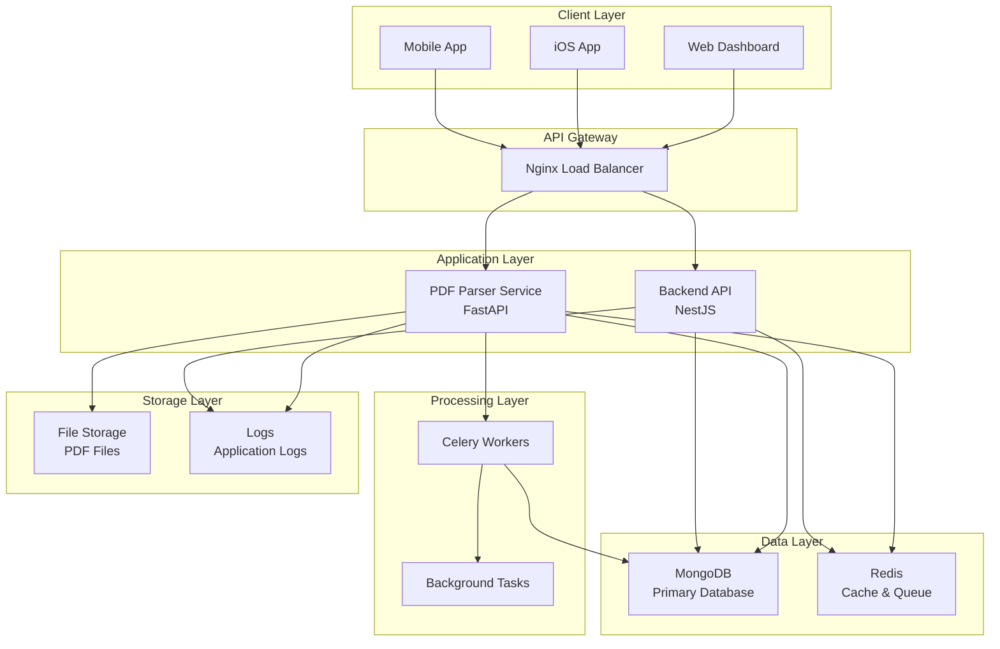
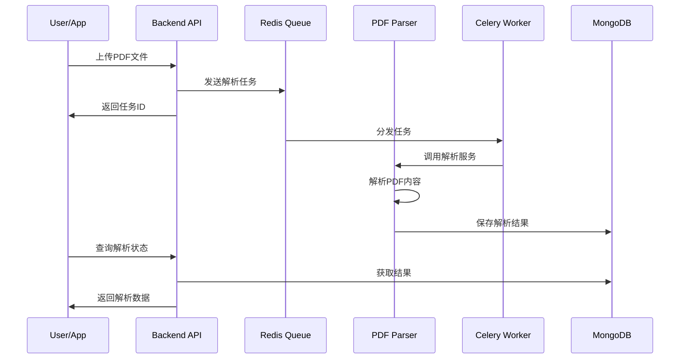
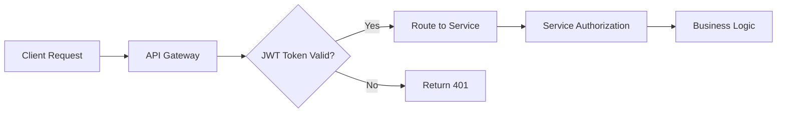

# 🏗️ NutriGuide 微服务架构设计

## 📋 架构概览

NutriGuide 采用微服务架构，将功能模块化为独立的服务，提供高可用性、可扩展性和可维护性。

## 🔧 技术选型对比

| 组件 | 技术选择 | 替代方案 | 选择理由 |
|------|----------|----------|----------|
| **Backend API** | NestJS + TypeScript | Express.js, Fastify | 企业级框架，装饰器支持，内置依赖注入 |
| **PDF Parser** | Python + FastAPI | Node.js, Go | 丰富的PDF处理库，AI/ML生态 |
| **数据库** | MongoDB | PostgreSQL, MySQL | 文档型存储，适合营养数据的复杂结构 |
| **消息队列** | Redis + Celery | RabbitMQ, Apache Kafka | 轻量级，支持多种数据结构 |
| **容器化** | Docker + Compose | Kubernetes | 简化开发环境，易于部署 |

## 🌐 服务间通信架构



## 📊 数据流设计

### 1. PDF解析流程



### 2. 数据同步机制

- **实时同步**: 小文件(<5MB) 同步处理
- **异步队列**: 大文件通过Celery队列处理
- **状态追踪**: Redis存储处理状态
- **结果缓存**: 解析结果缓存30天

## 🔒 安全架构

### 认证授权



### 安全措施

1. **API层面**
   - JWT token认证
   - Rate limiting
   - CORS配置
   - Input validation

2. **服务层面**
   - 服务间通信加密
   - 文件上传限制
   - 恶意文件检测

3. **数据层面**
   - 数据库连接加密
   - 敏感数据脱敏
   - 定期备份

## 📈 扩展性设计

### 水平扩展

```yaml
# 生产环境扩展配置
services:
  backend:
    deploy:
      replicas: 3
      resources:
        limits:
          memory: 1G
        reservations:
          memory: 512M

  pdf-parser:
    deploy:
      replicas: 2
      
  pdf-worker:
    deploy:
      replicas: 5  # 根据处理量调整
```

### 负载均衡策略

- **Backend API**: Round-robin负载均衡
- **PDF Workers**: 队列自动分发
- **数据库**: 读写分离 (未来)

## 🚀 部署架构

### 开发环境 (dev)

```
┌─────────────────────────────────────┐
│           Development               │
├─────────────────────────────────────┤
│ • 单机部署                           │
│ • 源码挂载热重载                      │
│ • 详细日志输出                       │
│ • MongoDB Admin UI                  │
└─────────────────────────────────────┘
```

### 测试环境 (qa)

```
┌─────────────────────────────────────┐
│              QA Testing             │
├─────────────────────────────────────┤
│ • 生产模式构建                       │
│ • 资源限制                          │
│ • 性能监控                          │
│ • 自动化测试                        │
└─────────────────────────────────────┘
```

### 生产环境 (prod)

```
┌─────────────────────────────────────┐
│            Production               │
├─────────────────────────────────────┤
│ • 多实例部署                        │
│ • Nginx负载均衡                     │
│ • SSL/TLS加密                       │
│ • 监控告警                          │
│ • 自动重启                          │
└─────────────────────────────────────┘
```

## 📊 性能优化

### 缓存策略

1. **应用层缓存**
   - Redis缓存热点数据
   - 解析结果缓存
   - 用户会话缓存

2. **数据库优化**
   - 索引优化
   - 查询优化
   - 连接池配置

3. **文件处理优化**
   - 分块上传
   - 压缩传输
   - CDN加速

### 监控指标

| 指标类型 | 监控项 | 阈值 |
|----------|--------|------|
| **系统性能** | CPU使用率 | <80% |
| **内存使用** | 内存占用 | <85% |
| **网络** | 响应时间 | <500ms |
| **队列** | 任务积压 | <100 |
| **错误率** | 5xx错误 | <1% |

## 🔧 运维指南

### 日常维护

```bash
# 服务状态检查
./scripts/status.sh

# 日志查看
docker-compose logs -f --tail=100 pdf-parser-prod

# 性能监控
docker stats

# 清理无用资源
./scripts/cleanup.sh
```

### 故障恢复

1. **服务重启**
   ```bash
   # 重启特定服务
   docker-compose restart pdf-parser-prod
   ```

2. **数据备份恢复**
   ```bash
   # 数据库备份
   docker exec mongodb-prod mongodump --out=/backup
   
   # 数据恢复
   docker exec mongodb-prod mongorestore /backup
   ```

3. **扩容处理**
   ```bash
   # 临时扩容worker
   docker-compose up --scale pdf-worker-prod=10 -d
   ```

## 🔮 未来规划

### 短期目标 (1-3个月)

- [ ] 增加更多PDF解析算法
- [ ] 实现AI辅助数据提取
- [ ] 添加批量处理功能
- [ ] 完善监控和告警

### 中期目标 (3-6个月)

- [ ] 微服务网格 (Service Mesh)
- [ ] 分布式追踪 (Distributed Tracing)
- [ ] 自动化CI/CD
- [ ] 多语言支持

### 长期目标 (6-12个月)

- [ ] Kubernetes部署
- [ ] 多区域部署
- [ ] 机器学习模型集成
- [ ] 实时数据分析

## 📚 技术债务

### 当前已知问题

1. **性能优化**
   - PDF解析速度有待提升
   - 大文件处理内存占用较高

2. **监控完善**
   - 缺少分布式追踪
   - 告警机制需要完善

3. **测试覆盖**
   - 集成测试覆盖率不足
   - 性能测试待补充

### 解决计划

- Q1: 性能优化和监控完善
- Q2: 测试覆盖率提升
- Q3: 架构重构和优化

---

## 📞 联系方式

- **架构师**: architecture@nutriguide.com
- **DevOps**: devops@nutriguide.com
- **技术支持**: tech-support@nutriguide.com 